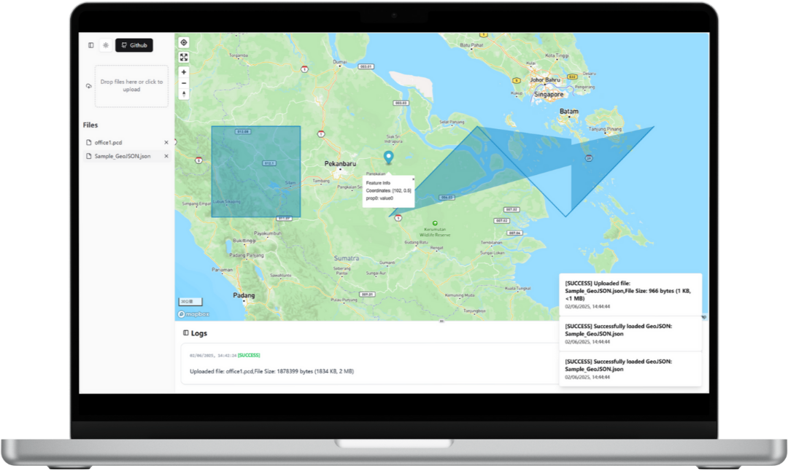

# 🚀 3D Point Cloud & GeoJSON Visualization Web App

This project is a **lightweight, front-end web application** built with **ReactJS** and **TailwindCSS**. It enables seamless visualization of **3D point cloud data** and **GeoJSON files**, offering an intuitive and interactive experience. The user interface is inspired by **VSCode**, ensuring a modern, efficient workflow.

---

## 🖼️ Interface Previews

Here are some screenshots showcasing the application:


*✨ Above: GeoJSON file visualization.*


*✨ Above: 3D point cloud visualization.*

---

## 🌟 Features

- **Drag & Drop File Upload**: Easily load 3D point cloud and GIS files.
- **Real-time Logs**: Track key actions and file statuses in the bottom log section.
- **Interactive 3D Viewer**: Rotate, zoom, and manipulate point cloud data.
- **Dynamic UI**: Interface elements adjust based on the selected file type.
- **Customizable Layout**: Expand/collapse panels for optimized viewing.
- **Multi-Format Support**: View diverse 3D data types.

### 📂 Supported Formats:
- **PCD** 📌 (Point Cloud Data)
- **XYZ** 📍 (Point Cloud XYZ Format)
- **TXT** 📄 (Raw Data Points)
- **PLY** 🏗️ (Polygon File Format)
- **JSON** 🗂️ (Generic JSON Data)
- **GeoJSON** 🗺️ (Geographic JSON Data)

---

## 🎯 User Interface Overview

### 🔹 Left-Side File List
- **Drag & Drop** files for quick access.
- **Search & Scroll** to find files easily.

### 🔹 Bottom Log Information
- **Live Updates**: See loading statuses, errors, and actions.
- **Collapsible**: Expand or hide logs as needed.

### 🔹 Main 3D Display
- **Interactive Viewer**: Rotate, zoom, and analyze your data.
- **Auto-Update**: Changes are reflected instantly upon file selection.
- **Adaptive UI**: Tools adjust based on file type.

### 🔹 Functionalities
 **Tools**: Rotate, zoom, switch visualization modes, and tweak display settings.

### 🔹 Expandable Panels
 **Custom Layout**: Toggle file list & logs for an optimal workspace.

---

## 🗃️ Sample Data

🔹 The project includes **sample datasets** for testing and demonstration.

📁 **Location**: `./sample_data/`

Example files:
- `sample_data/dragon.pcd` 📌 (Point Cloud)
- `sample_data/dragon.xyz` 📍 (Point Cloud XYZ)
- `sample_data/bunny.txt` 📄 (Point Cloud TXT)
- `sample_data/dragon.ply` 🏗️ (3D Model)
- `sample_data/example.json` 🗺️ (GIS Data)

Simply **drag & drop** them into the app to explore their visualization! ✨

---

## 🔄 Why Switch to Three.js?

Initially, the project used **pcl.js** for point cloud visualization. However, deployment on **Vercel** resulted in errors:

```sh
Uncaught (in promise) TypeError: __PCLCore__[n.name] is not a constructor
    at new YB (index-C8DWNnQa.js:2576:7298)
```

Caused by:
```typescript
const cloud = PCL.loadPCDData<PCL.PointXYZ>(arrayBuffer, PCL.PointXYZ);
```

**Solution:** Switched to **Three.js**, ensuring a more stable and versatile 3D rendering experience. 🏗️

---

## ⚡ How to Use

1️⃣ **Drag & Drop** supported files into the file list. <br/>
2️⃣ **Visualize** the data interactively in the 3D viewer. <br/>
3️⃣ **Use Functional Buttons** to adjust view settings. <br/>
4️⃣ **Monitor Logs** for real-time updates.

---

## 🔧 Installation Guide

💻 Run the project locally in 3 easy steps:

```sh
# 1️⃣ Clone the repository
git clone https://github.com/canyon/3d-web-viewer.git

# 2️⃣ Install dependencies
cd 3d-web-viewer
npm install

# 3️⃣ Start the development server
npm run dev
```

---

## 🚀 Future Enhancements

🔹 **More File Format Support**: LAS, OBJ, and more. <br/>
🔹 **Advanced GIS Features**: Map overlays, spatial analysis. <br/>
🔹 **Interactive Tools**: Filtering, measurements, and annotations.

---

🔥 **Get Started & Explore the 3D Visualization World Now!** 🚀

